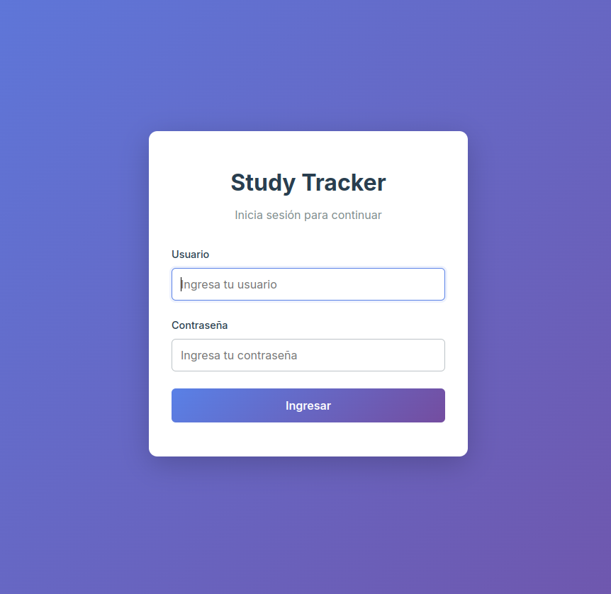
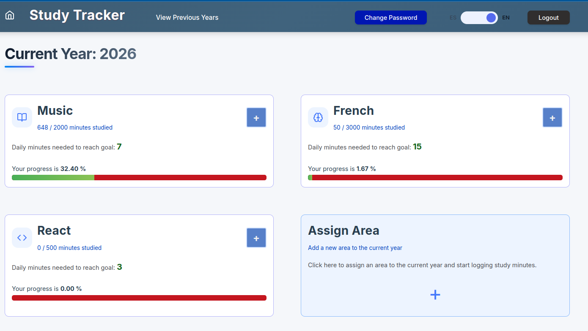
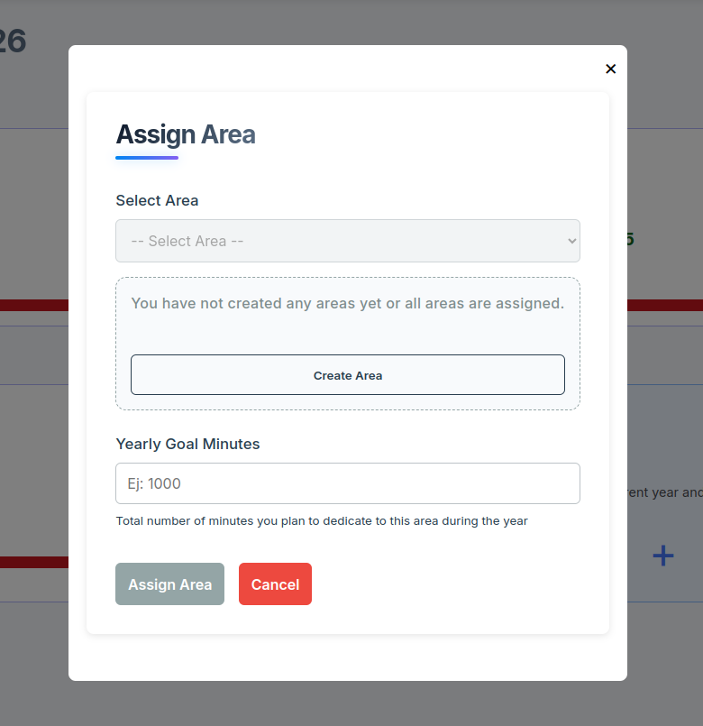
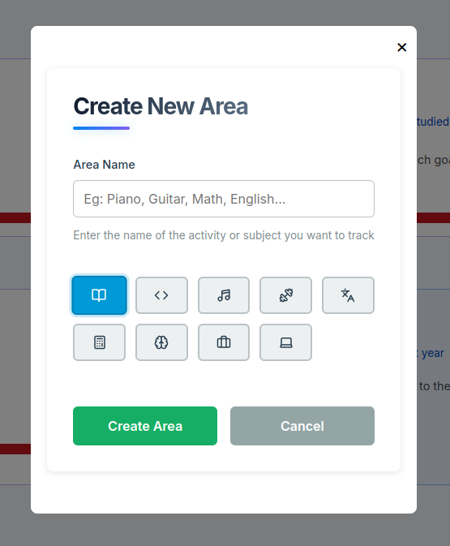
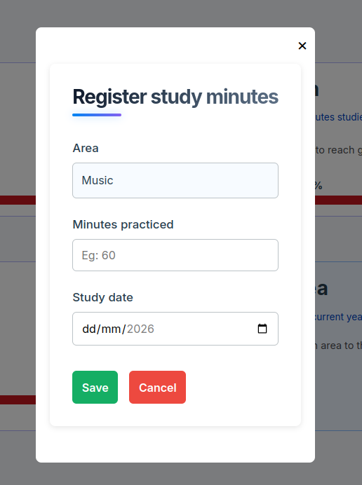
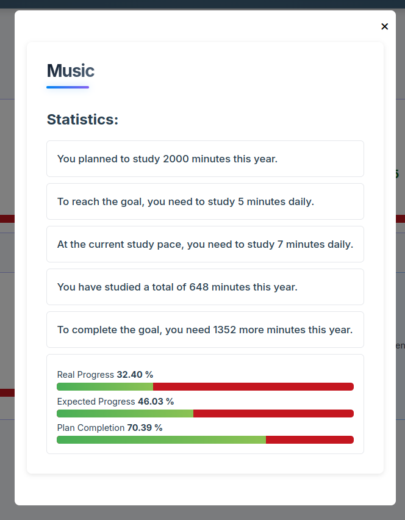

# Study Tracker

A web application designed to track study sessions, organize learning areas, and visualize learning progress over time.

## Preview

### Login



### Dashboard



### Areas

#### Asigning areas to the current year



#### Creating a new area



### Practice



### Statistics



## Why this project exists

Study Tracker started as a personal project to replace a large spreadsheet used to manage study sessions, track learning progress, and organize areas.

As the amount of information grew, maintaining everything in a spreadsheet became increasingly difficult. To solve that problem, I decided to build a dedicated application using React, NestJS, and MongoDB.

## Features

- Track study sessions and study time in minutes.
- Organize learning content by years and areas.
- Monitor progress on each area.
- View study statistics and progress metrics.
- User authentication and authorization.
- Admin user management.
- Fully Dockerized environment.
- Easy local deployment with Docker Compose.

## User Roles

### Administrator

The application creates a default administrator account during the initial database seed process.

Current administrator capabilities:

- Create new users.

### User

Regular users can:

- Log study sessions.
- Organize areas.
- Track learning progress.
- View study statistics and insights.

## Technologies

### Frontend

- React
- TypeScript
- React Query
- React Router
- CSS Modules
- Vite

### Backend

- NestJS
- TypeScript
- MongoDB
- Mongoose
- JWT Authentication

### Infrastructure

- Docker
- Docker Compose

## Architecture

```text
Frontend (React)
        |
        v
Backend API (NestJS)
        |
        v
MongoDB
```

## Getting Started

See the [Installation Guide](docs/installation.md).

## Tests

### Frontend
From the project root:

```bash
cd frontend
npm install
npm test
# Run once and generate an HTML test report:
npm run test:unit
# Generate coverage reports:
npm run test:coverage
```

Look for reports in:

- `frontend/coverage/test-results.html` — HTML test result report
- `frontend/coverage/test-results.json` — raw Vitest JSON results
- `frontend/coverage/` — coverage output directory

### Backend
From the project root:

```bash
cd backend
npm install
npm test
npm run test:cov
```

Look for reports in:

- `backend/coverage/test-results.html` — HTML Jest test result report
- `backend/coverage/lcov-report/index.html` — HTML coverage report
- `backend/coverage/` — coverage output directory

## First Login

A default administrator account is automatically created when the application runs for the first time.

Default credentials:

```text
Username: admin
Password: admin
```

⚠️ It is strongly recommended to change these credentials after installation.

## Default Ports

### Development

| Service  | Port |
|-----------|--------|
| Frontend | 5174 |
| Backend | 4000 |
| MongoDB | 27018 |

### Production

| Service  | Port |
|-----------|--------|
| Frontend | 4173 |
| Backend | 5000 |
| MongoDB | 27019 |

## Advanced Configuration

The default Docker setup works out of the box.

Advanced users can customize:

- JWT secret
- Token expiration
- MongoDB connection string
- Frontend API URL
- Published ports

See:

- `backend/.env.production`
- `frontend/.env.production`

## Project Status

Study Tracker is currently in the MVP (Minimum Viable Product) stage and is actively used for daily study tracking and learning management.

## Roadmap

### Completed

- [x] User authentication
- [x] User management
- [x] Areas management
- [x] Study session tracking
- [x] Progress tracking
- [x] Statistics dashboard
- [x] Dockerized development environment
- [x] Dockerized production environment

### Planned

- [ ] UI/UX improvements
- [ ] Reset password functionality by users
- [ ] Admin password reset functionality
- [ ] List of study sessions
- [ ] Old years statistics section
- [ ] Practices editing and deletion for current year
- [ ] Delete areas associated with current year (only if they don't have practices)
- [ ] Delete and edit areas for current year

## Contributing

This project is currently maintained as a personal project. Suggestions, ideas, and bug reports are always welcome.

## Support the Project

If Study Tracker helps you stay organized and focused on your learning goals, consider supporting its development.

### Argentina 🇦🇷

☕ Cafecito: ** https://cafecito.app/diegograf

### International 🌎

🌎 PayPal: ** https://paypal.me/diegorafaelgraf

## License

This project is published for educational, learning, and portfolio purposes.